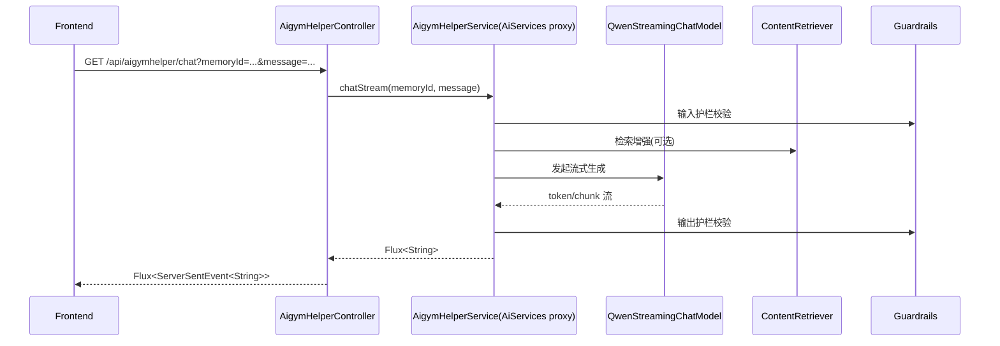

# AiGymHelper 详细流程文档

本文档基于当前仓库代码实现，描述 `aigymhelper` 的完整运行链路、关键配置、前后端交互、日志监听、常见故障与排查方法。

## 1. 模块目标

`aigymhelper` 提供一个流式 AI 教练能力：

- 前端发送用户问题（如训练计划、饮食建议）
- 后端通过 LangChain4j + DashScope(Qwen) 调用大模型
- 通过 SSE（`text/event-stream`）将结果按分片实时返回前端

---

## 2. 代码结构总览

### 2.1 Controller 层

- 文件：`backend/src/main/java/com/newgym/fitness/aigymhelper/AigymHelperController.java`
- 职责：
  - 暴露接口：`GET /api/aigymhelper/chat`
  - 接收参数：`memoryId`、`message`
  - 将 `Flux<String>` 转换为 `Flux<ServerSentEvent<String>>`

### 2.2 AI Service 接口

- 文件：`backend/src/main/java/com/newgym/fitness/aigymhelper/AigymHelperService.java`
- 职责：
  - 定义 AI 服务契约
  - `chatStream(@MemoryId, @UserMessage)` 作为流式入口
  - `@SystemMessage(fromResource = "system-prompt.txt")` 绑定系统提示词
  - `@InputGuardrails(SafeInputGuardrail.class)` 绑定输入护栏

### 2.3 工厂装配

- 文件：`backend/src/main/java/com/newgym/fitness/aigymhelper/AigymHelperFactory.java`
- 职责：
  - 通过 `AiServices.builder(AigymHelperService.class)` 生成代理实现
  - 注入普通模型 + 流式模型 + 记忆 + 检索器 + 护栏
  - 关键点：配置 `chatMemoryProvider` 以支持 `@MemoryId`

### 2.4 模型配置

- 普通模型：
  - 文件：`backend/src/main/java/com/newgym/fitness/aigymhelper/modle/QwenChatModelConfig.java`
  - Bean：`myQwenChatModel`
  - 挂载 `ChatModelListener`
- 流式模型：
  - 文件：`backend/src/main/java/com/newgym/fitness/aigymhelper/modle/QwenStreamingChatModelConfig.java`
  - Bean：`myQwenStreamingChatModel`
  - 同样挂载 `ChatModelListener`

### 2.5 监听器

- 文件：`backend/src/main/java/com/newgym/fitness/aigymhelper/AiGymHelperListenter.java`
- 职责：
  - 输出 `onRequest / onResponse / onError` 日志
  - 用于观察与模型交互的请求、响应和异常

### 2.6 Guardrail（护栏）

- 输入护栏：`SafeInputGuardrail.java`
- 输出护栏：`SafeOutputGuardrail.java`
- 当前示例规则：敏感词（`kill`, `evil`）拦截

### 2.7 RAG 配置

- 文件：`backend/src/main/java/com/newgym/fitness/aigymhelper/AiGymRagconfig.java`
- 职责：
  - 创建内存向量库 `InMemoryEmbeddingStore<TextSegment>`
  - 加载 `src/main/resources/docs` 文档并切段入库
  - 通过 `EmbeddingStoreContentRetriever` 提供检索增强

---

## 3. 后端启动与依赖关系

后端启动时，Spring 会完成以下 Bean 依赖装配：

1. `ChatModelListener`（来自 `AiGymHelperListenter`）
2. `myQwenChatModel`（普通模型）
3. `myQwenStreamingChatModel`（流式模型）
4. `ContentRetriever`（RAG）
5. `SafeInputGuardrail` / `SafeOutputGuardrail`
6. `AigymHelperService`（`AiServices` 代理）
7. `AigymHelperController`

只要其中任一环失败（例如模型配置、密钥、类路径版本冲突），`/api/aigymhelper/chat` 就无法正常工作。

---

## 4. 请求链路（后端）

---

## 5. 前端链路（Flutter）

### 5.1 API 调用

- 文件：`frontend/lib/api_client.dart`
- 方法：`aiCoachChatStream({memoryId, message})`
- 特点：
  - `GET /api/aigymhelper/chat`
  - `Accept: text/event-stream`
  - 行级解析 SSE：仅处理 `data:` 行
  - 首包超时阈值（当前代码中已调整为更高秒数）

### 5.2 机器人 UI

- 文件：`frontend/lib/widgets/ai_coach_fab.dart`
- 特点：
  - 可拖动悬浮入口
  - 打开后发送消息并持续监听流式 chunk
  - 每个 chunk 追加到最后一条 AI 消息
  - 支持本地历史持久化（`shared_preferences`）

---

## 6. 核心配置项

文件：`backend/src/main/resources/application.yml`

- `langchain4j.community.dashscope.chat-model.*`
- `langchain4j.community.dashscope.streaming-chat-model.*`
- `langchain4j.community.dashscope.embedding-model.*`

其中最关键的是：

- `streaming-chat-model.model-name`
- `streaming-chat-model.api-key`

如果流式模型配置错误，常见现象是：

- 接口进入了，但长时间无 chunk
- 前端超时
- 监听器可能仅有请求日志、无响应日志

---

## 7. 常见问题与排查

### 7.1 前端超时（页面提示“智能教练响应超时”）

排查顺序：

1. 看后端是否收到 `/api/aigymhelper/chat`
2. 看 Controller 是否拿到非空 `Flux`
3. 看是否有首个 chunk（首包耗时）
4. 看模型端错误（网络、密钥、模型名）

### 7.2 返回 200 但页面没收到

优先检查：

- 是否是 SSE 响应被其他过滤器包裹/缓存
- `Content-Type` 是否为 `text/event-stream`
- 前端是否正确解析 `data:` 行

### 7.3 Listener 没有输出日志

高频原因：

- Listener 只挂在 `ChatModel`，但请求走的是 `StreamingChatModel`
- 已修复方式：普通模型和流式模型都挂同一个 `ChatModelListener`

### 7.4 CORS 错误

现象：浏览器控制台预检失败（无 `Access-Control-Allow-Origin`）

处理：

- 在 `SecurityConfig` 启用全局 CORS
- 放行 `OPTIONS`
- 允许 `localhost:*` / `127.0.0.1:*`

---

## 8. 当前实现注意点（建议）

1. `AigymHelperController` 中应避免无意义的 `System.out.println(stream.map(...))` 调试输出，建议使用结构化日志。
2. `AigymHelperService` 同时存在 `chat(String)` 与 `chatStream(...)`，如果仅使用流式，可统一入口降低维护复杂度。
3. `modle` 目录命名建议更正为 `model`，避免团队协作歧义。
4. 调试阶段新增的埋点日志建议在问题收敛后清理，保留必要业务日志即可。

---

## 9. 最小可用验收清单

1. 后端启动无 Bean 创建异常  
2. `GET /api/aigymhelper/chat` 返回 `text/event-stream`  
3. 前端发送消息后可持续收到 chunk 并展示  
4. `AiGymHelperListenter` 可看到模型请求/响应日志  
5. 中文输出无乱码，长消息在超时阈值内可首包返回

---

## 10. 一句话总结

`aigymhelper` 的本质是：**Spring Controller + LangChain4j AiServices 代理 + Qwen 流式模型 + RAG + Guardrail + SSE 前端消费**。  
稳定性关键在于：**流式模型配置、首包时延、SSE链路不中断、以及可观测日志完整**。
